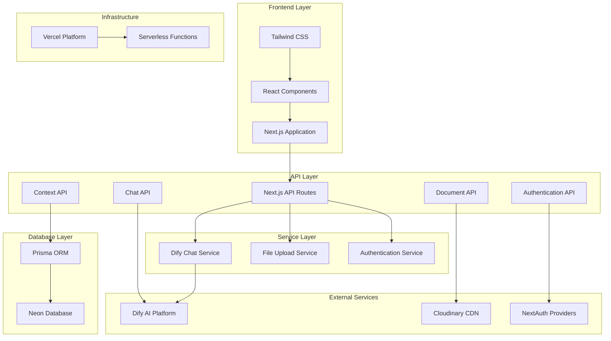

# 🚀 Kinesis HR

> Transform your hiring process with intelligent CV analysis, smart candidate ranking, and AI-driven decision making

## 📸 Screenshots

### Landing Page


### Set Up Kinesis HR


### Chat Interface


### Candidate Ranking


## 📋 Basic Information

### 🌐 Prototype URL

https://kinesishr.online

### 🎥 Presentation Materials (Video or PDF)

https://drive.google.com/file/d/1XRVTI61N62ic-ygs5SAU79URZ4j64BBN/view?usp=sharing

### 📱 Demo video on the actual device

https://youtu.be/OnNswVfV14w?si=APHzudOIkOycufT_

---

## 🎯 Product Overview

### Target Users

**HR Professionals & Recruiters** who need to efficiently screen large volumes of CVs and make data-driven hiring decisions. This includes:

- HR managers handling multiple job openings
- Talent acquisition specialists seeking faster candidate evaluation
- Small to medium businesses without dedicated recruitment teams
- Recruitment agencies managing multiple clients

### Problem to Solve

Traditional CV screening is time-consuming, subjective, and prone to human bias. HR professionals often spend hours manually reviewing resumes, struggling to consistently evaluate candidates across different skill sets and experience levels. This leads to:

- Inefficient use of HR resources
- Inconsistent candidate evaluation criteria
- Potential oversight of qualified candidates
- Delayed hiring processes affecting business productivity

### Solution

KinesisHR revolutionizes recruitment with AI-powered CV analysis that provides:

- **Intelligent CV Analysis**: Deep insights with detailed justification for each candidate
- **Smart Scoring & Ranking**: Comprehensive scoring with transparent reasoning
- **Interactive AI Assistant**: Chat-based interface for personalized candidate recommendations
- **Multi-language Support**: Local language support for global recruitment needs
- **Document Management**: Secure file upload and management system

---

## 🛠️ Tech Stack

### Frontend

- **Next.js 15.3.2** - React framework for production
- **React 19** - Latest React with concurrent features
- **TypeScript** - Type-safe development
- **Tailwind CSS 4** - Utility-first CSS framework
- **Radix UI** - Accessible component primitives
- **Framer Motion** - Animation library
- **React Hook Form** - Form state management
- **Zod** - Schema validation

### Backend

- **Next.js API Routes** - Serverless API endpoints
- **NextAuth.js** - Authentication solution
- **Prisma** - Database ORM and migration tool
- **PostgreSQL** - Primary database
- **Axios** - HTTP client for external APIs

### Database

- **Neon Database** - Serverless PostgreSQL for user data, contexts, and documents
- **Prisma Client** - Type-safe database access and migrations

### Infrastructure & Deployment

- **Vercel** - Frontend hosting and serverless functions
- **Neon Database** - Serverless PostgreSQL database
- **Cloudinary** - File storage and CDN

### Other Tools & APIs

- **Dify AI Platform** - AI chat and conversation management
- **Cloudinary** - Image and video management
- **React Player** - Video playback
- **Lucide React** - Icon library
- **Moment.js** - Date manipulation

---

## 🏗️ Architecture



---

## 🗓️ Development Process

### Technical Challenges

- **AI Integration Complexity**: Integrating with Dify AI platform required careful handling of streaming responses and conversation management. Solved by implementing a robust chat service with proper error handling and response processing.

- **Real-time Chat Experience**: Providing seamless AI chat functionality with conversation persistence. Implemented using streaming APIs and optimistic UI updates.

---

## 🚀 Setup & Installation

### Prerequisites

- Node.js 20 or higher
- Neon Database account
- Dify AI Platform API key
- Cloudinary account (for file uploads)

### Installation Steps

1. **Clone the repository**

   ```bash
   git clone https://github.com/powered-by-kinesis/kinesis-hr.git
   cd kinesis-hr
   ```

2. **Install dependencies**

   ```bash
   npm install
   ```

3. **Set up environment variables**

   ```bash
   cp .env.example .env
   # Fill in your environment variables:
   # DATABASE_URL=          # Neon Database connection string
   # NEXT_PUBLIC_BASE_URL=  # Your Vercel deployment URL
   # NEXTAUTH_SECRET=       # Random secret for NextAuth
   # NEXTAUTH_URL=          # Your Vercel deployment URL
   # GOOGLE_CLIENT_ID=      # Google OAuth credentials
   # GOOGLE_CLIENT_SECRET=  # Google OAuth credentials
   # CLOUDINARY_CLOUD_NAME= # Cloudinary config
   # CLOUDINARY_API_KEY=    # Cloudinary config
   # CLOUDINARY_API_SECRET= # Cloudinary config
   # DIFY_API_KEY=          # Dify AI Platform key
   # DIFY_API_URL=          # Dify AI Platform URL
   ```

4. **Set up the database**

   ```bash
   npx prisma migrate dev
   npx prisma generate
   ```

5. **Run the development server**

   ```bash
   npm run dev
   ```

---

## 👥 Team Information

| Role           | Name                     | GitHub                                                 | Responsibility                                |
| -------------- | ------------------------ | ------------------------------------------------------ | --------------------------------------------- |
| Team Lead      | Agus Heryanto            | [@agusheryanto182](https://github.com/agusheryanto182) | Project coordination & Full-stack development |
| AI Integration | Muhammad Hamdan Arrosyid | [@Hamdanarrosyid](https://github.com/Hamdanarrosyid)   | Dify AI integration & Chat functionality      |

---

## 📝 Notes & Limitations

- **File Size Limits**:
  - Per CV file: Maximum 10MB (PDF, DOC, DOCX)
  - Bulk upload: No total limit (performance may vary with large batches)
- **Language Support**: While the platform supports multiple languages, AI analysis quality may vary by language

---

## 🏆 Appeal Points

### Innovation & Technical Excellence

- **Cutting-edge AI Integration**: Seamless integration with Dify AI platform for intelligent CV analysis
- **Modern Tech Stack**: Built with the latest technologies including Next.js 15, React 19, and TypeScript
- **Responsive Design**: Beautiful UI with smooth animations and excellent user experience

### Business Impact

- **Efficiency Gains**: Automates manual CV screening process with instant AI analysis
- **Consistency**: Eliminates human bias with standardized AI-driven evaluation criteria
- **Scalability**: Can process multiple CVs simultaneously, improving throughput

### User Experience

- **Intuitive Interface**: Clean, professional design that's easy to navigate for HR professionals
- **Interactive Chat**: Natural language interaction with AI assistant for personalized recommendations
- **Comprehensive Analytics**: Detailed insights and justifications for every hiring decision

### Technical Architecture

- **Production Ready**: Serverless deployment on Vercel with proper error handling and logging
- **Secure**: Authentication, authorization, and secure file handling throughout
- **Maintainable**: Clean code architecture with proper separation of concerns and comprehensive documentation

---

_Made with ❤️ by Team KinesisHR_
