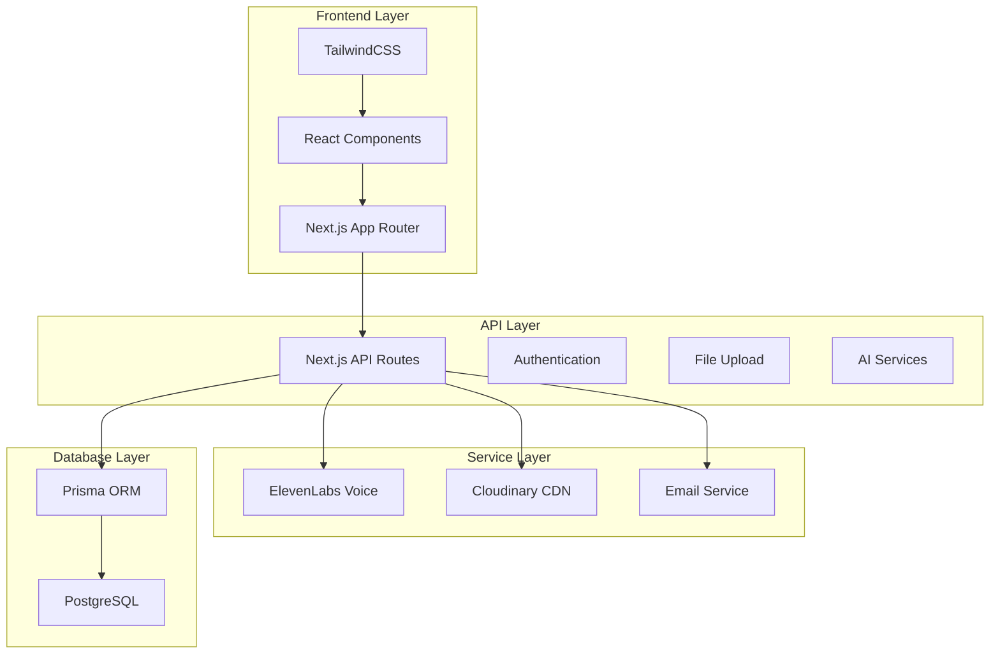

# 🚀 Kinesis HR

> Experience the next evolution in talent acquisition. Our AI-powered platform delivers unparalleled candidate analysis, sophisticated evaluation metrics, and data-driven insights empowering you to make exceptional hiring decisions with confidence and precision.

## 🎯 Product Overview

Kinesis HR is a cutting-edge recruitment platform that combines AI technology with intuitive design to streamline the entire hiring process. Our platform helps HR professionals and recruiters make data-driven decisions while providing a seamless experience for both employers and candidates.

### Target Users

- HR Managers and Recruiters
- Talent Acquisition Specialists
- Small to Medium-sized Businesses
- Recruitment Agencies
- Corporate HR Departments

### Core Features

#### 1. Advanced Applicant Tracking

- Comprehensive candidate progress monitoring
- Centralized recruitment dashboard

#### 2. AI-Powered Interviews

- Intelligent interview engine with adaptive questioning
- Real-time interview analytics
- 24/7 automated screening

#### 3. Seamless Application Process

- Modern, user-friendly interface
- Streamlined candidate experience
- Essential information capture
- Progress tracking for applicants

#### 4. AI Assistant Support

- 24/7 recruitment assistance
- Automated query handling
- Interview scheduling
- Status updates

## 🛠️ Tech Stack

### Frontend

- **Next.js 15.3.2** - React framework with App Router
- **React 19** - Latest React features
- **TypeScript** - Type safety
- **TailwindCSS 4** - Utility-first styling
- **Radix UI** - Accessible component primitives
- **Framer Motion** - Smooth animations
- **React Hook Form** - Form management
- **Zod** - Schema validation
- **Lucide React** - Icon system
- **Next Auth** - Authentication
- **Next Themes** - Dark mode support
- **Embla Carousel** - Image carousels
- **React Player** - Media playback
- **Recharts** - Data visualization
- **React Markdown** - Content rendering

### Backend

- **Next.js API Routes** - Serverless endpoints
- **Prisma 6.11** - Type-safe ORM
- **PostgreSQL** - Primary database
- **NextAuth.js** - Authentication
- **Nodemailer** - Email services
- **Cloudinary** - Media management
- **ElevenLabs** - Voice synthesis

### Development Tools

- **TypeScript 5.8** - Type checking
- **ESLint 9** - Code linting
- **Prettier** - Code formatting
- **Turbopack** - Fast builds

## 🏗️ Architecture



## 🚀 Getting Started

### Prerequisites

- Node.js 22.14+
- PostgreSQL database
- Cloudinary account
- ElevenLabs API key

### Installation

1. Clone the repository

```bash
git clone https://github.com/powered-by-kinesis/kinesis-hr.git
cd kinesis-hr
```

2. Install dependencies

```bash
npm install
```

3. Set up environment variables

```bash
cp .env.example .env
```

Required environment variables:

```
DATABASE_URL=

NEXT_PUBLIC_BASE_URL=

NEXTAUTH_SECRET=

NEXTAUTH_URL=

GOOGLE_CLIENT_ID=
GOOGLE_CLIENT_SECRET=

NODE_ENV=

CLOUDINARY_CLOUD_NAME=
CLOUDINARY_API_KEY=
CLOUDINARY_API_SECRET=
CLOUDINARY_URL=

DIFY_API_KEY=
DIFY_API_URL=

# SMTP Configuration
SMTP_HOST=smtp.gmail.com
SMTP_PORT=587
SMTP_SECURE=false
SMTP_USER=
SMTP_PASS=
SMTP_FROM=

ELEVENLABS_API_KEY=
NEXT_PUBLIC_AGENT_ID=
```

4. Initialize the database

```bash
npx prisma generate
npx prisma migrate dev
```

5. Start the development server

```bash
npm run dev
```

## 📝 Development Guidelines

### Code Style

- Follow TypeScript best practices
- Use functional components
- Implement proper error handling
- Write comprehensive comments
- Follow atomic design principles

### Testing

- Write unit tests for critical functions
- Test components in isolation
- Ensure responsive design works
- Verify accessibility compliance

### Performance

- Optimize image loading
- Implement proper caching
- Use code splitting
- Monitor bundle size

## 🔒 Security

- Secure authentication with NextAuth.js
- HTTPS enforcement
- Input validation
- File upload restrictions
- Rate limiting
- Data encryption

## 📈 Future Roadmap

- Enhanced AI interview capabilities
- Advanced analytics dashboard
- Multi-language support
- Mobile application
- Integration with ATS systems
- Automated reference checking
- Video interview features

## 👥 Contributing

1. Fork the repository
2. Create your feature branch
3. Commit your changes
4. Push to the branch
5. Create a Pull Request

## 📄 License

This project is licensed under the MIT License - see the LICENSE file for details.

---

_Built with ❤️ by the Kinesis HR Team_
